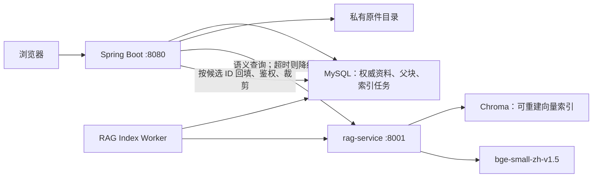

# 知趣·象限自主学习系统 RAG 工程实施方案

> 文档状态：改进版设计稿  
> 适用代码：`zhiqu-backend` 当前 Notebook / Agent 检索链路  
> 核心目标：在不破坏现有对话、引用、Evidence 和降级逻辑的前提下，把“资料前部关键词排序”升级为可恢复、可观测、严格隔离的语义检索。

## 1. 结论与关键决策

采用 **Spring Boot + Python RAG sidecar** 的方向不变，但必须调整原方案中的三个关键假设：

1. **不能直接向量化现有 2200 字符块。** `bge-small-zh-v1.5` 的输入长度有限，向量服务必须用 tokenizer 把父块拆成检索子块。
2. **索引写入不能只是 `@Async` 后记日志。** MySQL 与向量库之间通过事务内 outbox 和可重试 worker 保持最终一致。
3. **Chroma 不返回权威正文。** 向量检索只返回候选 ID、偏移和距离；Java 必须从 MySQL 回填正文并再次校验用户、Notebook、资料状态，确保删除立即生效且不会跨用户泄漏。

P0 明确不做 rerank、OCR、图片入库、Wiki 全局向量化和多机部署。这些能力在核心检索可靠后再按评测结果增加。

## 2. 当前代码基线

当前链路如下：

1. `createSource()` / `uploadSource()` 解析资料。
2. `writeChunks()` 按 2200 字符切块、180 字符重叠，写入 `ai_source_chunk`。
3. `AiServiceImpl` 把用户问题放入 `contextOptions.query` 后调用 `sourceContext()`。
4. `sourceContext()` 从 READY 资料的前部块中收集候选，最多收集约 24 条，做轻量字符串命中排序，最后全局保留 8 条。
5. 返回行被继续用于模型上下文、CITATION Artifact 和 Evidence。

现有挂载点是正确的，但现有中文查询并没有真正的分词，连续中文问题通常会被当成一个完整词串，因此语义召回有明确价值。

需要保留的兼容边界：

- `sourceContext()` 最终仍返回 `sourceId/title/sourceType/chunkIndex/content`。
- `selectedSourceIds` 的所有权与 READY 状态校验不能下放给 Python。
- Wiki 页面在 P0 继续使用现有逻辑。
- RAG 服务不可用时，必须回退到现有检索逻辑。
- `ai_notebook_source.status` 继续表示解析状态，不加入 `VECTORIZED` 值。

## 3. 总体架构



### 3.1 权威边界

- MySQL 和私有原件是权威数据。
- Chroma 只保存向量和非敏感定位元数据，默认不保存完整正文。
- 向量索引允许删除后重建，但必须记录索引版本和可观测的重建进度。
- “可重建”不等于“无需运维”：需要健康检查、版本锁定、索引延迟监控和重建时长目标。

### 3.2 进程边界

- Spring Boot 负责用户鉴权、资料所有权、事务、任务状态和正文回填。
- rag-service 负责 tokenizer 子分块、embedding、向量 upsert/delete/query。
- P0 的 Chroma 使用本地持久化目录时，rag-service 只能启动一个 worker 进程。
- 出现多实例、多主机或明显并发瓶颈后，再切换为 server-backed Chroma 或 Qdrant；Java 接口不随底层向量库变化。

## 4. 数据模型

### 4.1 保留父块，新增检索子块概念

`ai_source_chunk` 继续保存 2200 字符父块，作为引用和上下文的权威内容。向量服务在 ingest 时使用模型 tokenizer 将父块拆成子块：

- 目标长度：384～480 tokens。
- 重叠：48～80 tokens。
- 必须保留相对于父块的 `charStart/charEnd`。
- 查询命中后，Java 从父块中以命中区间为中心生成最多 1600 字符的 snippet，避免总是截取父块开头。

向量 ID 使用确定性格式：

```text
{indexVersion}:{sourceId}:{chunkId}:{segmentIndex}
```

每条向量至少包含以下 metadata：

| 字段 | 用途 |
| --- | --- |
| `userId` | 强制租户过滤 |
| `notebookId` | Notebook 范围过滤 |
| `sourceId` | 资料过滤与清理 |
| `chunkId` | Java 回填父块 |
| `chunkIndex` | 引用定位 |
| `segmentIndex` | 子块定位 |
| `charStart/charEnd` | 生成命中附近 snippet |
| `contentHash` | 检测陈旧索引 |
| `indexVersion` | 模型与分块版本隔离 |

### 4.2 `ai_notebook_source` 新增索引状态

建议在下一可用 Flyway migration 中增加：

| 字段 | 建议类型 | 说明 |
| --- | --- | --- |
| `content_hash` | `CHAR(64)` | 按有序父块内容计算 SHA-256 |
| `index_status` | `VARCHAR(20)` | `NOT_INDEXED/PENDING/INDEXED/RETRY/ERROR` |
| `index_version` | `VARCHAR(80)` | 当前成功索引版本 |
| `index_error` | `VARCHAR(1000)` | 最近一次失败原因 |
| `indexed_at` | `DATETIME` | 最近成功时间 |

解析状态仍使用现有 `status=UPLOADED/PARSING/READY/ERROR`。前端若要展示向量化进度，读取独立的 `indexStatus`，不能把 `status` 改成 `VECTORIZED`。

### 4.3 新增 `rag_index_job` outbox

建议字段：

| 字段 | 说明 |
| --- | --- |
| `id` | 主键 |
| `dedupe_key` | 唯一幂等键 |
| `operation` | `UPSERT_SOURCE/DELETE_SOURCE/DELETE_NOTEBOOK/REINDEX_SOURCE` |
| `user_id/notebook_id/source_id` | 操作范围；允许部分为空 |
| `content_hash` | 本次期望内容版本 |
| `target_index_version` | 目标索引版本 |
| `status` | `PENDING/RUNNING/RETRY/COMPLETED/DEAD` |
| `attempts` | 已尝试次数 |
| `next_retry_at` | 指数退避时间 |
| `locked_at/locked_by` | worker 抢占信息 |
| `last_error` | 最后错误 |
| `created_at/updated_at/completed_at` | 审计时间 |

outbox 不保存正文。UPSERT worker 每次从 MySQL 读取当前父块，DELETE job 即使资料已逻辑删除也能根据任务中的 ID 清理索引。

## 5. 一致性与生命周期

### 5.1 新增或重新解析资料

同一个 MySQL 事务内完成：

1. 写入资料和父块。
2. 计算 `content_hash`。
3. 设置 `index_status=PENDING`。
4. 插入幂等的 `UPSERT_SOURCE` job。
5. 提交事务。

事务提交后，由定时 worker 拉取 job，而不是在业务方法中直接启动裸线程或立即调用 sidecar。

worker 流程：

1. 抢占一个到期任务。
2. 重新读取 source 和 chunks。
3. 校验 source 仍存在、属于任务中的用户和 Notebook、`content_hash` 未变化。
4. 分批调用 rag-service ingest。
5. ingest 成功后更新 `index_status=INDEXED` 和 `indexed_at`。
6. 失败则指数退避；超过上限进入 DEAD，并保留管理员重试入口。

### 5.2 删除资料或 Notebook

删除事务内同时插入 DELETE job，再执行现有 MySQL 级联/逻辑删除。向量清理允许异步，但用户侧必须立即不可见：

- rag-service 即使暂时返回孤儿候选，Java 回填时也必须丢弃不存在、已删除或不属于当前用户的记录。
- Chroma 默认不保存正文，因此孤儿向量不会直接把已删除正文返回给模型。
- DELETE job 持续重试，最终释放磁盘。

删除失败不能被描述为“只浪费磁盘”；只有在完成 Java 权威回填和即时过滤后，异步清理才是安全的。

### 5.3 同版本全量重建与模型升级边界

- `indexVersion` 同时包含 embedding 模型、模型 revision、分块算法版本和距离度量，例如 `bge-small-zh-v1.5@sha-token480-v1-cosine`。
- P0 的 Generation 蓝绿只用于同一 `indexVersion` 的全量重建；新旧 Generation 使用不同 collection，禁止在同一 collection 混合数据。
- 管理员重建接口只创建后台任务并返回 `jobId`，不能在 HTTP 请求中同步遍历全表。
- 同版本新 collection 完整构建并通过抽样检查后再切换活动 Generation，旧 collection 延迟清理，支持快速回滚。
- P0 sidecar 一次只服务一个模型及 `indexVersion`。模型、模型 revision、分块算法或距离度量升级时，存在回退到 LEGACY 关键词检索的窗口；跨版本无缝蓝绿不属于 P0。

## 6. rag-service 接口契约

所有接口使用 `/v1` 版本前缀。请求头使用 `Authorization: Bearer <RAG_SERVICE_TOKEN>`；服务仅监听 loopback 或容器内部网络，并限制请求体大小。

### 6.1 健康与版本

```http
GET /health/live
GET /health/ready
GET /v1/meta
```

`/v1/meta` 返回活动模型、模型 revision、向量维度、indexVersion、距离度量和 collection 状态。ready 只有在模型与 collection 都可查询时才返回成功。

### 6.2 索引资料

```http
POST /v1/index/sources
```

请求示例：

```json
{
  "operationId": "job-1842",
  "userId": 21,
  "notebookId": 7,
  "sourceId": 93,
  "contentHash": "sha256...",
  "indexVersion": "bge-small-zh-v1.5@pinned-token480-v1-cosine",
  "batchNo": 0,
  "finalBatch": true,
  "chunks": [
    {
      "chunkId": 501,
      "chunkIndex": 0,
      "content": "父块正文"
    }
  ]
}
```

要求：

- `operationId + batchNo` 幂等。
- 请求分批发送，限制单批 chunk 数和正文总字节数。
- 使用确定性 ID upsert 当前 generation，成功后再清理该 source 的旧 generation，避免“先删后写”中途失败形成空索引。
- 返回实际写入数量、跳过数量、内容 hash 和 indexVersion。

### 6.3 查询

```http
POST /v1/query
```

请求示例：

```json
{
  "requestId": "chat-request-id",
  "userId": 21,
  "notebookId": 7,
  "question": "操作系统产生死锁需要哪些条件？",
  "candidateK": 24,
  "sourceIds": [93, 94],
  "indexVersion": "bge-small-zh-v1.5@pinned-token480-v1-cosine"
}
```

返回示例：

```json
{
  "indexVersion": "bge-small-zh-v1.5@pinned-token480-v1-cosine",
  "metric": "cosine",
  "candidates": [
    {
      "vectorId": "...",
      "sourceId": 93,
      "chunkId": 501,
      "chunkIndex": 0,
      "segmentIndex": 2,
      "charStart": 620,
      "charEnd": 1018,
      "distance": 0.18
    }
  ]
}
```

约束：

- `userId` 和 `notebookId` 必填，where 条件必须使用 `$and` 同时过滤两者和活动 indexVersion。
- `sourceIds` 只能进一步缩小范围，不能扩大范围。
- `candidateK` 由服务端限制在安全区间，例如 1～32。
- 字段使用 `distance`，不使用含义模糊的 `score`；cosine distance 越小越相关。
- query embedding 使用固定中文检索指令并归一化；collection 显式配置 cosine。
- 相关性阈值必须由真实评测集校准，不能凭经验硬编码。

### 6.4 删除索引

```http
POST /v1/index/delete
```

```json
{
  "operationId": "job-1901",
  "userId": 21,
  "scope": "SOURCE",
  "notebookId": 7,
  "sourceId": 93
}
```

`scope` 只允许 `SOURCE/NOTEBOOK/USER/INDEX_VERSION`。避免使用携带 JSON body 的 DELETE 请求，也避免省略 sourceId 时默认删除整个用户这种危险语义。

## 7. Java 查询流程

`sourceContext()` 拆成清晰的四层，而不是在原方法中堆积 HTTP 和数据库逻辑：

1. `SourceScopeResolver`：校验 Notebook、READY source 和 `selectedSourceIds`。
2. `RagRetriever`：调用 sidecar，设置连接/读取超时和熔断。
3. `ContextCandidateHydrator`：按候选 `chunkId` 批量回填 MySQL，重新验证所有权与状态，并生成命中附近 snippet。
4. `ContextBudgeter`：去重、限制单资料占比、合并 Wiki、应用全局条数和字符预算。

推荐流程：

```text
校验用户范围
  → 查询 24 个向量候选
  → MySQL 批量回填并丢弃陈旧/越权候选
  → 同一父块去重
  → 每份资料最多 3 条（仅多资料时）
  → 合并现有 Wiki context
  → 全局最多 8 条、总正文建议不超过 10,000 字符
  → 返回现有 citation row 结构
```

返回行可以增加以下可选字段，现有前端忽略它们也不受影响：

```json
{
  "retrievalMode": "VECTOR",
  "distance": 0.18,
  "similarity": 0.82,
  "indexVersion": "...",
  "chunkId": 501,
  "segmentIndex": 2
}
```

### 7.1 降级策略

| 场景 | 行为 |
| --- | --- |
| sidecar 超时、拒绝连接、ready=false | 整轮使用现有 legacy 检索 |
| 部分 source 尚未索引 | 已索引 source 用向量，未索引 source 用 legacy，再统一预算 |
| 候选回填后全部无效 | 使用 legacy 检索 |
| 仅少量有效候选 | 保留有效向量结果，并用 legacy 补足 |
| indexVersion 不匹配 | 不查询旧版本，直接降级并触发索引修复 |

建议初始超时：连接 300ms、读取 1500～2000ms；具体值由部署机器 P95 数据调整。降级必须记录原因，但不能让 sidecar 故障中断对话主流程。

### 7.2 执行轨迹

继续复用现有 RETRIEVER step 和 CITATION Artifact，不必新建一套 UI。step 的完成摘要记录：

- `retrievalMode=VECTOR/MIXED/LEGACY`
- 候选数、有效回填数、最终上下文数
- 查询耗时
- 活动 indexVersion
- 降级原因（若有）

不得把 service token、完整用户问题或敏感正文写入普通日志。

## 8. 配置建议

Spring Boot：

```yaml
app:
  rag:
    enabled: false
    base-url: http://127.0.0.1:8001
    service-token: ${RAG_SERVICE_TOKEN:}
    connect-timeout-ms: 300
    read-timeout-ms: 1800
    candidate-k: 24
    final-k: 8
    max-context-chars: 10000
    max-per-source: 3
    fallback-enabled: true
    index-version: ${RAG_INDEX_VERSION:}
```

rag-service：

```text
RAG_SERVICE_TOKEN
RAG_DATA_DIR
RAG_MODEL_PATH
RAG_MODEL_REVISION
RAG_INDEX_VERSION
RAG_DEVICE=cpu
RAG_MAX_BATCH_TOKENS
RAG_LOG_LEVEL
```

模型和 Python 依赖必须锁定版本；生产部署预下载模型，不依赖首次启动访问公网。

## 9. PDF 与图片解析路线

解析升级与向量检索是两条独立链路，不能在同一 P0 同时改变，以免无法判断质量变化来自解析还是召回。

### 9.1 当前真实能力

- Notebook 上传目前使用 PDFBox 文本提取，最多保留 15000 字符。
- Notebook 图片只保存原件，不生成 chunk。
- `/api/ai/analyze` 已存在“PDF 无文字时渲染前 3 页并交给视觉模型”的兜底，但它是任务分析路径，不是 Notebook 入库路径。

### 9.2 P0′：结构化 PDF A/B

对 OpenDataLoader 先做独立实验，不直接替换生产链路：

1. 选取真实中文讲义、双栏论文、表格密集 PDF、扫描件各若干份。
2. 对比 PDFBox 与 OpenDataLoader 的文字完整率、阅读顺序、标题层级、表格结构、耗时和峰值内存。
3. 建立质量门：每页字符数、乱码率、重复行比例、结构元素数量。
4. 只有实测收益达到门槛才启用 `OpenDataLoader → 质量不合格时 PDFBox`。
5. 旧资料若要受益，必须执行“重新解析原件 → 重建父块 → 重建向量”，仅重建 Chroma 不会改善旧解析结果。

不要仅在 OpenDataLoader 抛异常时回退，因为解析器可能正常返回但内容质量较差。15000 字符上限改为可配置的页数、字符数、耗时和内存限制，不能简单无限放开。

### 9.3 P2：扫描件与图片

- 先实现扫描件判据，再选择 OpenDataLoader Hybrid、本地 OCR 或视觉模型通道。
- Notebook OCR 必须覆盖完整受支持页数，并明确费用、超时、隐私和失败重试；不能照搬当前只分析前 3 页的逻辑。
- OCR 结果进入与文本资料相同的父块、outbox 和索引管线。
- 图片资料在没有可靠 OCR/视觉描述前保持“不参与问答”，避免仅凭文件名生成低质量向量。

## 10. 安全与隐私

必须满足：

1. Java 从 `SecurityUtils` 获取 userId，前端不得自行传入权威 userId。
2. rag-service 查询强制按 `userId + notebookId + indexVersion` 过滤。
3. Java 对返回候选再次做 MySQL 所有权、READY 状态和删除状态校验。
4. selected source 必须在 Java 侧验证后才传入 sidecar。
5. Chroma 默认不保存完整正文；服务日志不得输出正文或 token。
6. service token 只从环境变量注入，支持轮换，比较时使用安全实现。
7. 上传内容始终视为不可信数据；OpenDataLoader 的隐藏文本过滤不能替代提示词注入防护，模型上下文中仍要明确把资料标为引用数据而非指令。
8. 删除后即使向量物理清理暂时失败，Java 也不得把已删除资料回填给模型。

## 11. 可观测性与运维

至少记录以下指标：

| 指标 | 用途 |
| --- | --- |
| `rag_query_latency_ms` P50/P95 | 查询性能 |
| `rag_query_fallback_total{reason}` | sidecar 稳定性 |
| `rag_candidates_returned/hydrated/final` | 陈旧索引与预算诊断 |
| `rag_index_job_lag_seconds` | 索引新鲜度 |
| `rag_index_job_retry/dead_total` | 写入故障 |
| `rag_vectors_by_version` | 重建与清理进度 |
| `rag_cross_scope_candidate_dropped_total` | 隔离异常告警 |

运维要求：

- rag-service 和 Spring Boot 都有自动重启与独立日志。
- 模型加载失败时 ready=false，但 Spring Boot 仍可用 legacy 检索。
- 定期抽样比对 MySQL source/chunk 数与活动 indexVersion 的向量数。
- 向量目录可以不进入权威业务备份，但必须有一键后台重建流程和已验证的重建时间。

## 12. 测试与验收

### 12.1 自动化测试

单元测试：

- tokenizer 子块不超过最大 token，偏移能准确还原父块内容。
- 确定性 ID 和重复 ingest 幂等。
- query filter 始终包含 userId、notebookId 和 indexVersion。
- distance/similarity 转换正确。
- snippet 围绕命中区间裁剪，不固定截取父块开头。
- ContextBudgeter 的去重、每 source 上限和全局字符预算。

集成测试：

- 用户 A 永远无法检索用户 B 的资料。
- selectedSourceIds 只能检索所选资料。
- 上传事务回滚时不产生可见向量。
- 删除后，即使 DELETE job 尚未完成，也无法再引用资料。
- sidecar 停机、超时、返回脏 ID 时自动降级且对话成功。
- 重复任务、worker 崩溃恢复、过期 RUNNING 任务重新领取。
- 同一 indexVersion 的新旧 Generation 蓝绿切换和回滚；模型/indexVersion 升级时验证 LEGACY 降级窗口。

### 12.2 质量评测集

上线前建立真实讲义评测集，建议至少 20 份资料、50 个问题，覆盖：

- 原文精确问法、同义改写、跨段落问法。
- 专有名词、英文缩写、公式文字。
- 无答案问题。
- 多资料同主题、selected source、Wiki 混合场景。

验收门槛建议：

| 指标 | 门槛 |
| --- | --- |
| 跨用户/删除后泄漏 | 0 |
| sidecar 故障时主流程成功率 | 100% 进入 legacy 路径 |
| Recall@8 | 不低于 0.85，或比现有检索提高至少 20 个百分点 |
| Citation Precision | 不低于 0.90 |
| 暖机后查询 P95 | 不高于 1.5 秒，最终以目标机器为准 |
| 正常负载索引延迟 P95 | 不高于 60 秒 |
| DEAD job | 正常运行期间为 0；出现时可告警和人工重试 |

相关性阈值、candidateK 和 finalK 只允许依据该评测集调整。

## 13. 分阶段交付

| 阶段 | 内容 | 交付条件 | 参考工作量 |
| --- | --- | --- | --- |
| P-1 基线 | 评测集、legacy 指标、目标机性能基线 | 可重复运行并生成报告 | 1～2 天 |
| P0-A 语义检索 | sidecar、token 子块、cosine query、Java 回填、全局预算、降级 | 质量指标达标，关闭开关可回滚 | 3～4 天 |
| P0-B 可靠性 | outbox、重试、删除、状态、健康检查、后台重建、同版本 Generation 蓝绿 | 故障与隔离测试全部通过 | 2～3 天 |
| P0′ 解析实验 | OpenDataLoader/PDFBox A/B、质量门、可配置限制 | 提交对比报告后决定是否启用 | 1～3 天 |
| P1 质量增强 | top-24 → rerank → top-8、混合检索、邻块扩展 | 只有评测显著提升才上线 | 2～4 天 |
| P2 多模态 | 扫描件 OCR、图片描述、完整入库管线 | 明确费用、隐私、页数和失败策略 | 视方案而定 |
| P3 扩展 | Wiki 全局索引、多机向量库 | 有真实容量或并发需求再实施 | 视条件而定 |

原方案的 2～3 天适合做演示性 POC；包含一致性、删除、重建、隔离和验收的可靠 P0，更现实的是 5～8 个工作日，不包含解析升级。

## 14. P0 完成定义

只有同时满足以下条件，P0 才算完成：

- [ ] RAG 开关默认可控，关闭后完全回到现有行为。
- [ ] 2200 字符父块没有被直接作为单一 embedding 输入。
- [ ] MySQL 是正文与权限的唯一权威，Chroma 不直接决定可见内容。
- [ ] 上传、删除和重建均通过可重试 outbox 驱动。
- [ ] 删除后立即不可检索，跨用户隔离测试为零泄漏。
- [ ] sidecar 故障不影响正常对话。
- [ ] selected source、Wiki、CITATION、Evidence 和执行轨迹兼容。
- [ ] 模型、依赖、indexVersion 均已锁定并可离线启动。
- [ ] 质量、延迟、索引延迟和降级率都有可复现报告。
- [ ] 完成一键重建和一次实际演练。

## 15. 实施时的代码落点

建议新增或修改的模块边界：

```text
zhiqu-backend/
├─ src/main/java/com/zhiqu/rag/
│  ├─ RagClient.java
│  ├─ RagProperties.java
│  ├─ RagRetriever.java
│  ├─ RagIndexJobService.java
│  ├─ RagIndexWorker.java
│  ├─ ContextCandidateHydrator.java
│  └─ ContextBudgeter.java
├─ src/main/java/com/zhiqu/entity/RagIndexJob.java
├─ src/main/java/com/zhiqu/mapper/RagIndexJobMapper.java
├─ src/main/resources/db/migration/Vxx__rag_indexing.sql
└─ src/test/java/com/zhiqu/rag/...

rag-service/
├─ app/main.py
├─ app/api.py
├─ app/embedding.py
├─ app/segmenter.py
├─ app/vector_store.py
├─ app/settings.py
├─ tests/
├─ pyproject.toml
└─ README.md
```

`AiWorkspaceServiceImpl` 只负责调用上述抽象并保留 legacy 方法，不直接承担 HTTP、tokenizer、重试和向量库细节。这样未来替换 embedding 模型或向量库时，不需要再次改动 Agent、引用和前端链路。

## 16. 参考资料

- BGE 模型卡：<https://huggingface.co/BAAI/bge-small-zh-v1.5>
- BGE 配置：<https://huggingface.co/BAAI/bge-small-zh-v1.5/raw/main/config.json>
- Chroma 客户端与部署说明：<https://docs.trychroma.com/reference/python/client>
- Chroma collection 配置：<https://docs.trychroma.com/docs/collections/configure>
- OpenDataLoader PDF：<https://github.com/opendataloader-project/opendataloader-pdf>
- OpenDataLoader Java 接入：<https://www.opendataloader.org/docs/quick-start-java>
